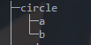
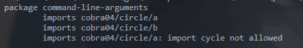
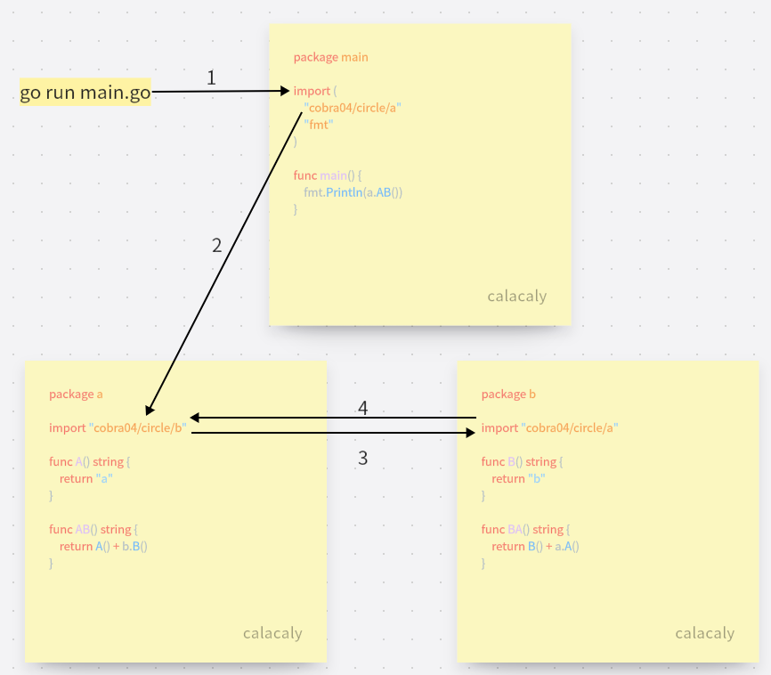

# Cobra04 - 项目工程目录结构（简单）

## 提示

阅读 [golang项目结构](https://github.com/golang-standards/project-layout) 
h

> 提示： 这个标准是一个 **建议**， 开源社区大多循序此标准， **自己写代码， 可以遵循）。 而在不同的公司， 可能因为各种原因， 有自己的标准。 

## 作业要求

1. 将 [作业: cobra - 01 实现编译与参数绑定](https://www.devopscamp.cc/semi-plan-202301-2/posts/homework/cobra01/) 进行改造， 改造完成后符合工程目录

**参考建议**

```bash
$ tree
.
├── cmd
│   └── appname
│       ├── cmd
│       │   └── root.go
│       └── main.go
└── pkg
    └── greeting
        └── greeting.go
```

2. 要求参数列表使用结构体保存

```go
type Person {
    Name string
    Age int
}
```

**注意**， 拆分目录结构之后， 就会出现 **包函数（跨文件夹）** 的调用， golang 是不允许 **循环依赖** 的。

## 扩展作业

什么是循环依赖？

## 解题思路

```go
//创建结构体类型
type Person struct {
    Name string
    Age int
}

//创建一个Person类型的空数据
var person = Person{}

//使用person.访问结构体的属性
//值访问或指针访问
person.Name
person.Age
&person.Name
&person.Age
```

> 什么是循环依赖？

一个简单的示例



```
circle包内，有a,b两个包，如果a和b互相import就会导致循环依赖
go run main.go会提示报错
```



示意图



在3和4步骤中会一直循环下去，循环依赖无法通过编译
