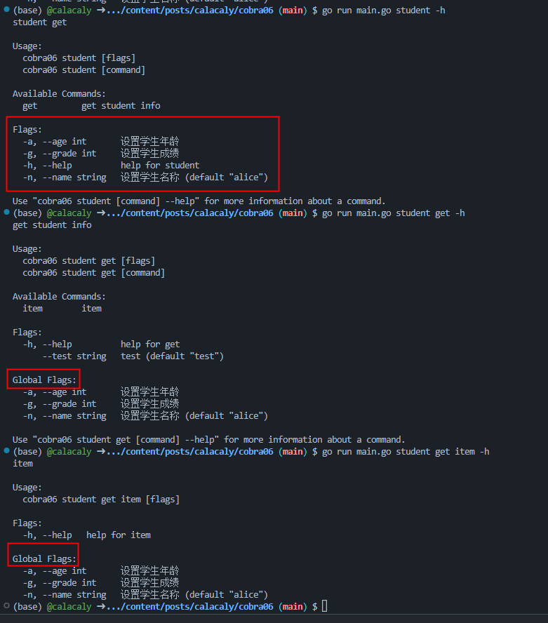
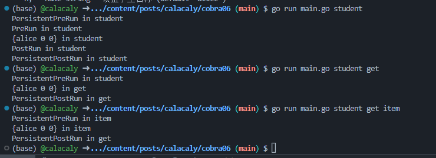

# Cobra06 - 持久化任务与参数 （简单）

## 提示

```go

func main() {
	root := cobra.Command{
		PersistentPreRun:  func(cmd *cobra.Command, args []string) {},
		PersistentPostRun: func(cmd *cobra.Command, args []string) {},
	}

	root.PersistentFlags()
}
```

## 作业要求

在 cobra 中提供了 **Persistent** Run 和 Flag，

1. 作用是什么？
2. 父子孙命令之间， 是否具有继承关系？ 优先级是什么？

自己想一段功能实现。 并论证。


## 解题思路
1. 查看cobra官网文档
	https://cobra.dev/
	其中PreRun and PostRun Hooks这一解释了PersistentPreRun和PersistentPostRun，
	作用是在主函数执行之前或之后执行，
	执行顺序是
   + PersistentPreRun
   + PreRun
   + Run
   + PostRun
   + PersistentPostRun

	PersistentFlags: 
	```text
	A flag can be ‘persistent’ meaning that this flag will be available to the command it’s assigned to as well as every command under that command. For global flags, assign a flag as a persistent flag on the root.

	父命令上使用PersistentFlags，子命令以及中也会有该Flags
	```

	
	

	


2. 父子命令之间具有继承关系
   
   	子命令可以继承父命令的持久标志，继承或重写父命令的PersistentPreRun和PersistentPostRun方法
	
	优先级: 在已执行的命令中，子命令的优先级高

	实现见代码,效果如下

	
	

	在子命令中Flags已经变成Global Flags

	

	PersistentPreRun和PersistentPostRun是持久Run方法, 
	如果子命令没有重写该方法，则会使用父命令中的持久Run方法
