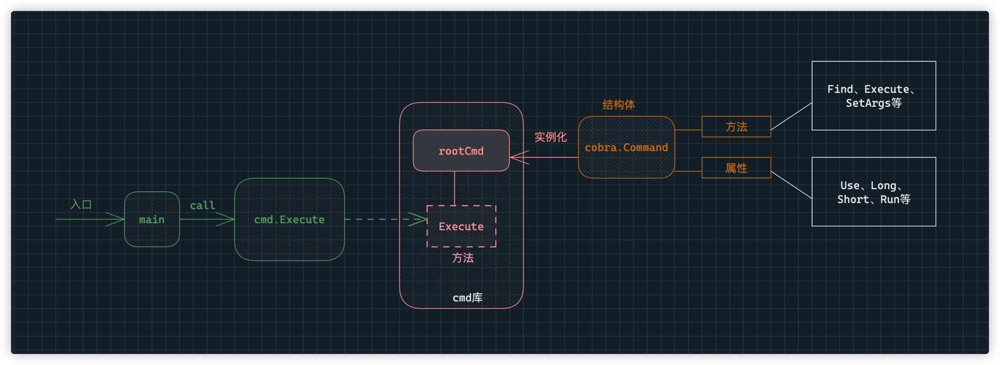
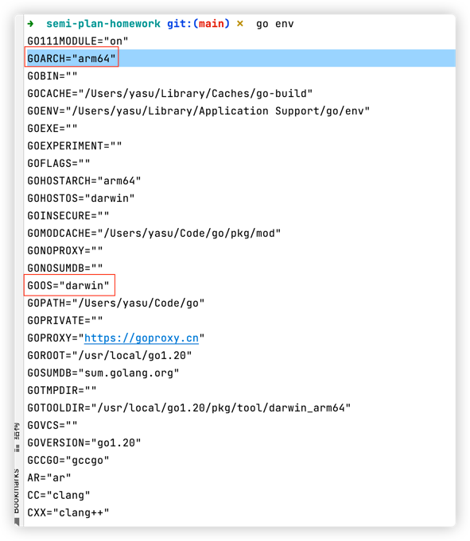

# 作业: cobra - 01 实现编译与参数绑定

要求:

1. 使用 https://github.com/spf13/cobra 实现命令工具
2. 命令具有以下参数
    1. `--name` 姓名
    2. `--age` 年龄
3. 如果年龄为空， 默认为 20 岁。
4. 完成交叉编译脚本， 编译其他平台的二进制文件

```
-rwxr-xr-x  1 franktang  staff  4220672 Jan 13 15:35 greeting-darwin-amd64
-rwxr-xr-x  1 franktang  staff  4203442 Jan 13 15:35 greeting-darwin-arm64
-rwxr-xr-x  1 franktang  staff  4215010 Jan 13 15:35 greeting-linux-amd64
-rwxr-xr-x  1 franktang  staff  4157892 Jan 13 15:35 greeting-linux-arm64
```

5. 执行输出效果如下

```bash
$ ./out/greeting-darwin-arm64
 你好, 今年 20 岁

$ ./out/greeting-darwin-arm64 --age 30 --name zhangsan
zhangsan 你好, 今年 30 岁
```

## 解题思路


### 编写代码前的准备工作
```shell
# 初始化 go mod 
go mod init
# 安装 依赖
go get github.com/spf13/cobra
```

### 调用逻辑


> Cobra 官方提供了 [cobra-cli](https://github.com/spf13/cobra-cli/blob/main/README.md) 工具来帮助我们快速生成目录结构和框架代码<br>
> 为了熟悉 cobra ，本次练习我不使用 cobra-cli 来生成框架文件，而是自己手动创建文件

### 程序入口
创建 main.go 文件
```go
func main() {
	cmd.Execute()
}
```

### 核心代码（cmd 包）
创建 cmd 目录，在 cmd 目录下创建 root.go 文件
>建议每个命令都单独对应一个文件，并使用命令名命名


```go
// 实例化一个根命令
var rootCmd = &cobra.Command{
    // 命令的相关文本信息
    Use:   "greeting",
    Short: "give me your name and age,I will greet you",
    Long:  `this is a CLI demo for devops camp homework.`,

    // 该命令的执行逻辑
    Run: func(cmd *cobra.Command, args []string) {
    fmt.Printf("%s 你好，今年 %v 岁\n", name, age)
    },
}

// 命令运行前的初始化工作在 init() 中定义
func init() {
    // 绑定标志
    rootCmd.Flags().IntVar(&age, "age", 20, "add info: age")
    rootCmd.Flags().StringVar(&name, "name", "", "add info: name")

}

func Execute() {
    if err := rootCmd.Execute(); err != nil {
    fmt.Println("execute err:", err)
    os.Exit(1)
    }
}
```

### 交叉编译
在不同架构和不同类型的操作系统中编译构建时需要指定对应的参数，否则生成的可执行文件在其他架构或系统中是无法正常运行的，因此在交叉编译脚本中，首先要判断当前系统的类型和架构，然后再指定对应的参数来构建

使用 `go env` 命令可以获取当前操作系统的类型（GOOS）和所用架构（GOARCH），如图：


Go 编译命令：
```shell
# go build -o <目标文件名> <main包所在文件> 
go build -o out/greeting .
# 当最后参数为.时，Go会自动寻找当前目录下的main包文件
```

指定操作系统类型和架构的 Go 编译命令：
```shell
CGO_ENABLED=0 GOOS=xxx GOARCH=xxx go build -o <目标文件名> <main包所在文件> 
```
其中：
- `CGO_ENABLED` 是否使用 C语言 版本的 Go 编译器，默认为1，如果代码中使用了 C的库，就设置为1
- `GOOS` 操作系统类型，包括 windows、linux 和 darwin
- `GOARCH` 操作系统架构，包括 amd64 和 arm64

### 参考文档
- [Go Module 介绍](https://cloud.tencent.com/developer/article/2031559)
- [Cobra 文档](https://github.com/spf13/cobra/blob/main/user_guide.md)
- [Go 的交叉编译](https://blog.csdn.net/peng2hui1314/article/details/119936821)
- [Go 项目的 Makefile 编写](https://juejin.cn/post/6977657870472970270)
