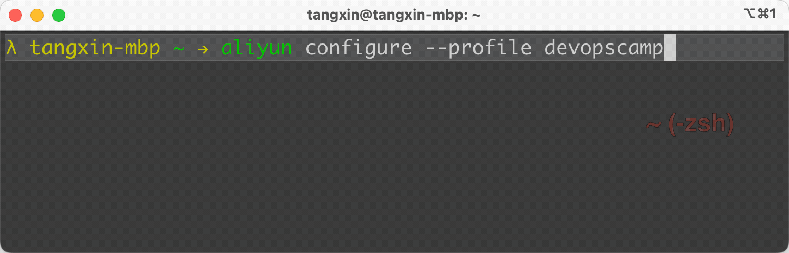

# 作业: cobra - 03 交互式命令

要求:

1. 使用 https://github.com/spf13/cobra 实现命令工具
2. 使用 https://github.com/go-survey/survey 实现交互式命令

3. 实现 Demo 效果


除了官方效果之外， 我还发现了 `aliyun` 命令行工具在配置账户的时候使用的是 **交互式** ， 如下



为了更好的体现 **实战性**， 我们将以 `aliyun configure --profile` 的作为例子， 并进行一些优化。


## 解题思路
本次练习要实现两个命令：
- 不加任何参数实现 survey 的 demo 
-  configure 子命令，用来实现 aliyun configure --profile 一样的功能
### 关键逻辑
1. 交互式怎么实现？ 
   > 使用 cobra 执行命令，在 command.Run 中实现 使用 survey 进行的交互式操作
2. 子命令怎么添加？
   > 使用 rootCmd.AddCommand(configureCmd) 实现

### 核心步骤


安装 survey 库
```shell
go get github.com/AlecAivazis/survey/v2
```
<br>

#### 实现 survey demo
定义 交互问题集，具体参数参考官方文档
```go
var demoQuestionSet = []*survey2.Question{
	{
		Name:      "name",
		Prompt:    &survey2.Input{Message: "What is your name?"},
		Validate:  survey2.Required,
		// 首字母是否大写
		Transform: survey2.Title,
	},
	{
		Name: "color",
		Prompt: &survey2.Select{
			Message: "Choose a color:",
			Options: []string{"red", "blue", "green"},
			Default: "red",
		},
	},
}

```
定义一个结构体类型的变量用来接收用户回答的内容，结构体字段名与每个问题相对应
```go
var demoAnswers = struct {
	Name          string
	FavoriteColor string `survey:"color"`
}{}
```

定义 rootCmd.Run 执行的核心函数
```go
func RunDemo(cmd *cobra.Command, args []string) {
	err := survey2.Ask(demoQuestionSet, &demoAnswers)
	if err != nil {
		fmt.Println(err.Error())
		os.Exit(1)
	}
	fmt.Printf("%s's favorite color is %s.\n", demoAnswers.Name, demoAnswers.FavoriteColor)
}
```
<br>

#### 实现 aliyun configure --profile devopscamp
定义 问题集
```go
var profileQuestionSet = []*survey2.Question{
	{
		Name:     "access_key_id",
		Prompt:   &survey2.Input{Message: "Access Key ID[]"},
		Validate: survey2.Required,
	},
	{
		Name:     "access_key_secret",
		Prompt:   &survey2.Input{Message: "Access Key Secret[]"},
		Validate: survey2.Required,
	},
	{
		Name:     "default_region_id",
		Prompt:   &survey2.Input{Message: "Default Region ID[]"},
		Validate: survey2.Required,
	},
	{
		Name:     "default_output_format",
		Prompt:   &survey2.Input{Message: "Default Output Format[json]", Default: "json (Only upport json)"},
		Validate: survey2.Required,
	},
	{
		Name:     "default_language",
		Prompt:   &survey2.Input{Message: "Default Language?[zh|en]"},
		Validate: survey2.Required,
	},
}
```
定义 答案内容结构体变量
> 结构体中每个字段的标签用于匹配问题集中每个问题的 Name 字段
```go
var profileAnswers struct {
	AccessKeyID         string `survey:"access_key_id"`
	AccessKeySecret     string `survey:"access_key_secret"`
	DefaultRegionID     string `survey:"default_region_id"`
	DefaultOutputFormat string `survey:"default_output_format"`
	DefaultLanguage     string `survey:"default_language"`
}
```
添加子命令到根命令上
```go
func init() {
	// 注册子命令 configureCmd
	rootCmd.AddCommand(configureCmd)
	configureCmd.Flags().StringVarP(&profile, "profile", "p", "", "target ")
}
```
定义 configureCmd.Run 执行的核心函数
```go
func Configure(cmd *cobra.Command, args []string) {
	fmt.Printf("Configuring profile '%s' in authenticate mode...\n", profile)
	err := survey2.Ask(profileQuestionSet, &profileAnswers)
	if err != nil {
		fmt.Println(err.Error())
		os.Exit(1)
	}

	jsonByte, err := json.MarshalIndent(profileAnswers, "", "\t")

	err = ioutil.WriteFile(profile+".profile", jsonByte, os.ModePerm)
	if err != nil {
		fmt.Println("write profile err:", err)
		os.Exit(1)
	}
}

```