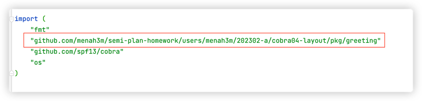

# Cobra04 - 项目工程目录结构（简单）

## 提示

阅读 [golang项目结构](https://github.com/golang-standards/project-layout) 
h
> 提示： 这个标准是一个 **建议**， 开源社区大多循序此标准， **自己写代码， 可以遵循）。 而在不同的公司， 可能因为各种原因， 有自己的标准。 

## 作业要求

1. 将 [作业: cobra - 01 实现编译与参数绑定](https://www.devopscamp.cc/semi-plan-202301-2/posts/homework/cobra01/) 进行改造， 改造完成后符合工程目录

**参考建议**

```bash
$ tree
.
├── cmd
│   └── appname
│       ├── cmd
│       │   └── root.go
│       └── main.go
└── pkg
    └── greeting
        └── greeting.go
```

2. 要求参数列表使用结构体保存

```go
type Person {
    Name string
    Age int
}
```

**注意**， 拆分目录结构之后， 就会出现 **包函数（跨文件夹）** 的调用， golang 是不允许 **循环依赖** 的。

## 扩展作业

什么是循环依赖？


## 解题思路

1. 在项目目录下新建 `cmd` 和 `pkg` 两个目录，`cmd` 作为入口 ，`pkg` 用于存放公共包
2. 在 `cmd` 下新建 应用目录，这里我以 `my-cobra-demo` 作为应用目录名
3. 将 **作业: cobra - 01 实现编译与参数绑定** 中实现的代码整体复制到 `cmd/my-cobra-demo` 目录下
4. 到这一步程序是可以正常运行的（当然不要忘记 `go mod init` 和 `go mod tidy`）
5. 接下来需要对每条命令的核心逻辑进行抽象，即需要将 command.Run 对应的函数 Greet 单独定义到 `pkg` 下
6. 在 `pkg` 目录中新建 `greeting` 目录，进入 `pkg/greeting` 目录新建 *greeting.go* 文件 
7. Greet 操作的对象是 `Person` ，首先我们创建一个 结构体类型 Person ，用来存放参数
   ```go
    type Person struct {
       Name string
       Age  int
    }
    ```
8. 创建 Person 的 Greet 方法
    ```go
    func (p *Person) Greet(cmd *cobra.Command, args []string) {
        fmt.Printf("%s 你好，今年 %v 岁\n", p.Name, p.Age)
    }
   ```
9. `cmd/my-cobra-demo/cmd` 下的 *root.go* 文件内容也需要做对应修改

      ```go
      import (
          "fmt"
          "github.com/menah3m/semi-plan-homework/users/menah3m/202302-a/cobra04-layout/pkg/greeting"
          "github.com/spf13/cobra"
          "os"
      )
      // 实例化一个 Person 对象
       var person greeting.Person

       var rootCmd = &cobra.Command{
    
       Use:   "greeting",
       Short: "give me your name and age,I will greet you",
       Long:  `this is a CLI demo for devops camp homework.`,
       // Run 调用的是 person 实例的 Greet 方法
       Run: person.Greet,
       }

       func init() {
       // 绑定变量到 person 实例上
       rootCmd.Flags().IntVar(&person.Age, "age", 20, "add info: age")
       rootCmd.Flags().StringVar(&person.Name, "name", "", "add info: name")
    
       }
      ```
      > 需要导入 pkg/greeting 包 才可以正常使用 greeting 包中定义的结构体和方法
   >

### 循环依赖
Go 包的依赖关系只能是单向的关系，如果包与包之间的依赖关系形成一个闭环，Go 程序编译时会报错
